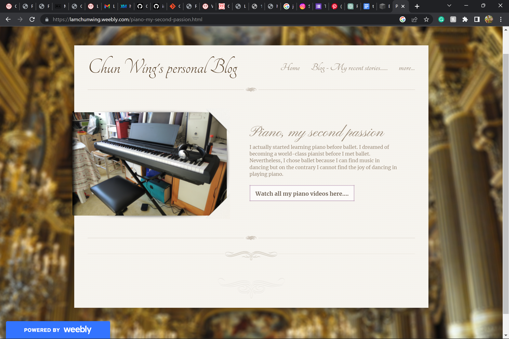
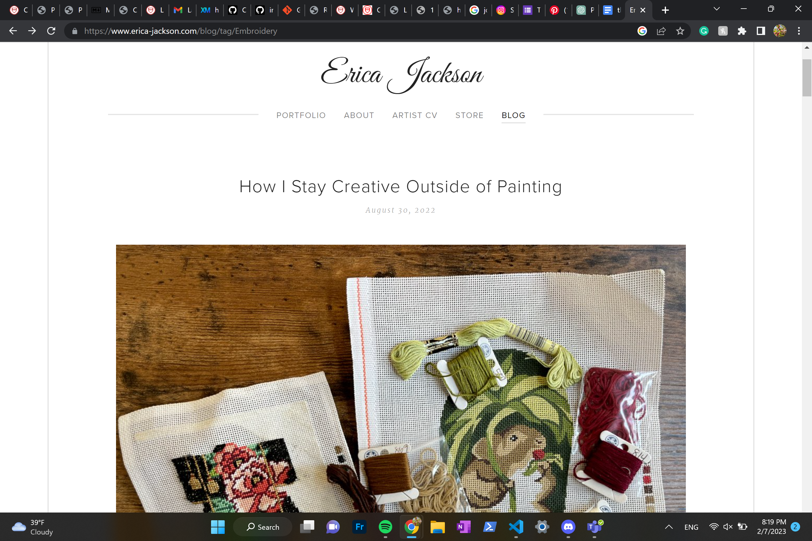
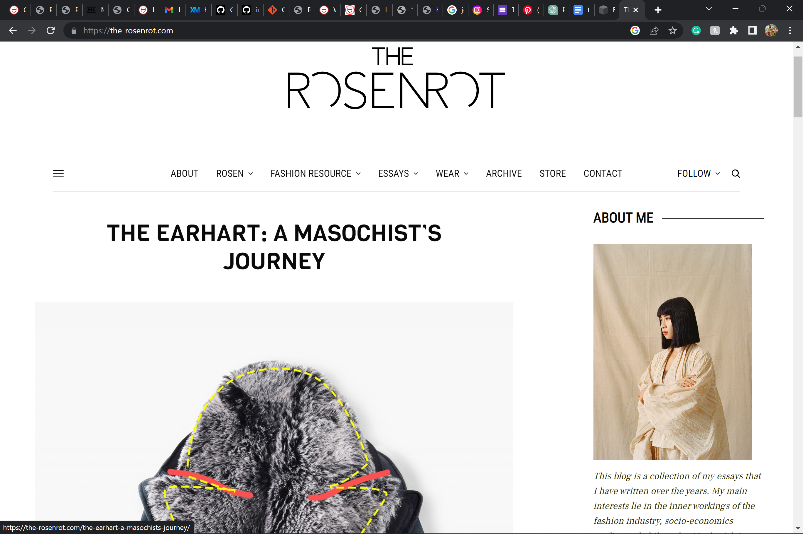
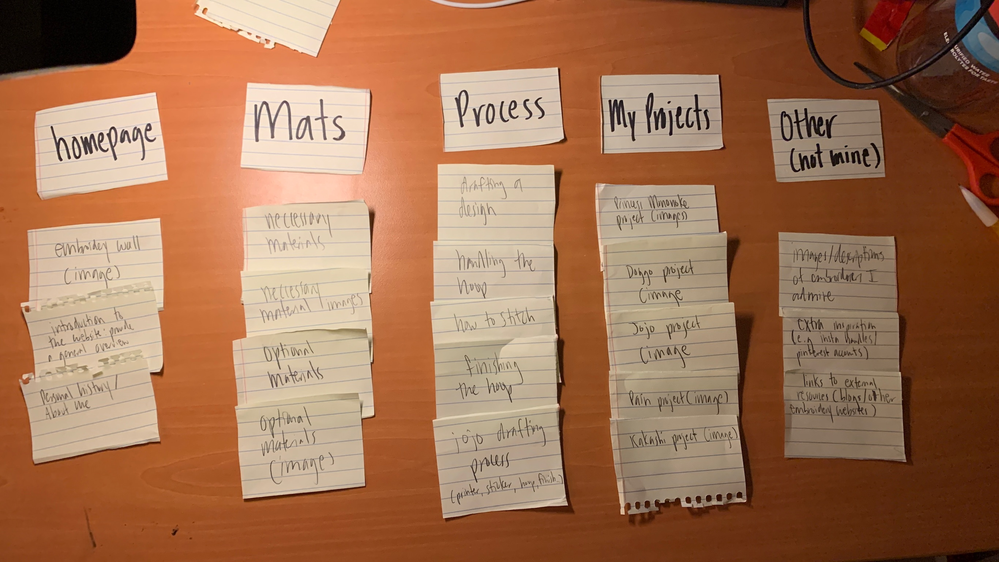
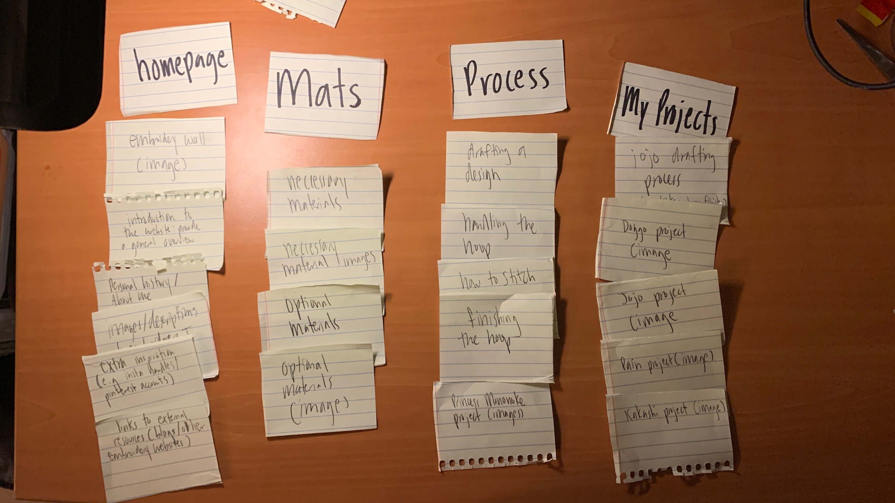

# Project 1: Design Journey

**For each milestone, complete only the sections that are labeled with that milestone.** Refine all sections before the final submission.

You are graded on your design process. If you later need to update your plan, **do not delete the original plan, leave it in place and append your new plan _below_ the original.** Then explain why you are changing your plan. Any time you update your plan, you're documenting your design process!

**Replace ALL _TODOs_ with your work.** (There should be no TODOs in the final submission.)

Be clear and concise in your writing. Bullets points are encouraged.

**Everything, including images, must be visible in _Markdown: Open Preview_.** If it's not visible in the Markdown preview, then we can't grade it. We also can't give you partial credit either. **Please make sure your design journey should is easy to read for the grader;** in Markdown preview the question _and_ answer should have a blank line between them.

## Markdown Instructions

**TODO: delete this section before submission.**

This is a Markdown file. All written documents that you will submit this semester will be Markdown files. Markdown is a commonly used format by developers and bloggers. It's something that you should know. Learning it is a learning objective of this course.

**Please use the official [Markdown Reference Documentation](https://commonmark.org/help/) if you aren't sure how to "code" Markdown.**

This is an example for inserting images into Markdown:

**TODO: delete this section before submission.**

## Personal Site (Milestone 1)

### Website Topic (Milestone 1)
> Briefly explain what your website will be about. Share your vision of your personal website.
>
> I plan to make a website about one of my favorite hobbies: embroidery. I plan to create a website that delves into the creative process of finding an idea to embroider, as well as share what materials I use. I also want to include my finished project at the end as well as some artists who inspire me.

### Device (Milestone 1)
> How you will your audience likely access your website? On a laptop/desktop computer or a mobile device?
> You will design your website for mobile or desktop devices (not both).

> I want to design for a desktop site.

## Personal Website Design Exploration (Milestone 1)

Identify three personal websites (preferably static websites) that exist today on the web. You will be drawing inspiration from these sites for your own site; please select websites that are similar to the website you wish to create.

Include a screenshot of the home page for each site. If you're planning a mobile website, your screenshots should be from a mobile website. If you're planning a desktop website, your screenshots should be from a desktop website.

**We'll refer to these are your "example websites."**

> TODO: Remove this example in your submission.
> Example: **(You may not use the instructors' websites for this part.)**
>
1. <https://lamchunwing.weebly.com/piano-my-second-passion.html/>
 

1. <https://www.erica-jackson.com/blog/tag/Embroidery/>
   

2. <https://the-rosenrot.com/>

    

### Personal Website 1 Review (Milestone 1)
> Review the personal website you identified above. (1-2 paragraphs)
>
> - Who do you think this site is designed for? Who is its intended audience?
> - What **goals** do you think the audience likely has when visiting this site.
> - What **content** is included?
> - Do you believe the content likely **addresses** the goals of the site's audience?
> - What do you like about the design?
> - Is the site designed for desktop, mobile, or desktop and mobile devices?

> - I think that these websites were created for those who had interest in classical music, specifically those of an older age.
> - The goals the audience has is to probably find people with similar interests as them, or people looking for musical inspiration.
> - The content in the websites include images of the piano, links that lead to the blogger's personal works, as well as a navigation bar that leads to contact information and personal history.
> - Yes, I believe the content addresses the audience's goals. The content provided is descriptive and goes along with the images well. Since the text goes hand in hand with the images, it makes it really easy to follow and thus fulfills the audience's goals of learning more about the piano.
> - Though the piano page is quite short, after exploring other parts of the website I found myself enjoying the varying lengths of text and the different sizes of images. I wasn't a big fan of the cursive font, but that is a personal preference.
> - This site seems to be designed for desktops. It does not format well on mobile.

### Personal Website 2 Review (Milestone 1)
> Review the personal website you identified above. (1-2 paragraphs)
>
> - Who do you think this site is designed for? Who is its intended audience?
> - What **goals** do you think the audience likely has when visiting this site.
> - What **content** is included?
> - Do you believe the content likely **addresses** the goals of the site's audience?
> - What do you like about the design?
> - Is the site designed for desktop, mobile, or desktop and mobile devices?

> - This website is designed for potential customers and employers in order to get to know this artist better.
> - Content includes a personal history of how the artist became interested in embroidery and painting, as well as images of her work and her artistic process. There is also contact information and a link to her store via the navigation bar
> - I think the content does address the goals of the audience. If I was an employer or customer, I could definitely get the information I needed and enough of it to make a decision about her as an artist. The images also help show what kind of artist she is which is very important
> - I like how the design is very plain and simple. I also appreciate how some of the text is transparent, such as the date and the nav bar. This helps draw emphasis to the artist's name and the more important content the user wants to see.
> - This website is also designed for desktops.

### Personal Website 3 Review (Milestone 1)
> Review the personal website you identified above. (1-2 paragraphs)
>
> - Who do you think this site is designed for? Who is its intended audience?
> - What **goals** do you think the audience likely has when visiting this site.
> - What **content** is included?
> - Do you believe the content likely **addresses** the goals of the site's audience?
> - What do you like about the design?
> - Is the site designed for desktop, mobile, or desktop and mobile devices?

> - This website is intended for those who want to learn about different kinds of fashion and avant garde fashion history.
> - Goals include wanting to be well-versed in fashion lingo, keeping up-to-date in trends, and learning opinionated fashion history.
> - Content includes images of clothing, extensive essay-like blog posts, and links to stores and contact information.
> - The content does address the audience's goals. It is well organized and the prose is concise. This allows for easy access to the information desired and makes it easier to retain.
> - I think that out of all the websites, this one has the most thoughtfully chosen images and formatting. The text is incredibly easy to read, and the images are very captivating and draw my attention deeper into the blog.
> This site is designed for desktops, but works well on my mobile device as well.

## Audience & Goals (Milestone 1)

Using what you learned from studying the example websites, identify your website's audience and their goals.

### Audience (Milestone 1)
> Briefly explain who the intended audience is for your website. Be specific and justify why this audience is appropriate for your site's topic.

> My website's audience are those who want to learn more about hand embroidery. It is targeted to the beginner audience who wants to learn how to start embroidering and find the right materials to do so. This audience is appropriate for this topic because my site will focus on giving advice and offering inspiration for beginner artists. For example, I plan to have sections on how I transfer designs onto fabric to embroider on, as well as a page where I go through the complete process of creating an embroidered piece.

### Audience Goals (Milestone 1)
> Why would your audience visit your site?
> Identify at least 3 goals that your users have for visiting your website.

1. To find the best materials and a good process to start embroidering.
2. Find artistic inspiration through my and others work.
3. To discover a niche genre of embroidery.

## Content Planning (Milestone 1)

Plan your site's content.

### Your Site's Planned Content (Milestone 1)
> List **all** the content you plan to include your personal website.
> You should list all types of content you planned to include (i.e. text, photos, images, etc.)

- text
- photos
- links
- captions

### Content Justification (Milestone 1)
> Explain (about a paragraph) why this content is the right content for your site's audience and how the content addresses their goals.

> Images are appropriate because embroidery is largely visual and having images will help engage the audience. Text is defintely necessary to describe the artistic process as well as offer specific advice on certain techniques. Links are important as well as I plan to link certain items on Amazon for example, as well as other artists' social medias for inspiration. Captions are important for the images, as there will be how-to pictures that need to be explained. All of this together will meet the audience's goal of wanting to learn more about embroidery because it will provide visual, textual, and external advice for starting embroidery.

### Home Page Content (Milestone 1)
> What is the content that your users would expect when visiting your site for the first time.
>
> Briefly identify what content you will include on the homepage and why this content should be the first thing your target audience sees when they visit your site.

> I plan on having the homepage content include a large captivating image to draw the audience's attention. I will then include a brief introduction on what the site is about, and perhaps a short personal history about how I got into the craft. I will then encourage the audience to explore other pages to learn more about embroidery. I think this is would be an effective homepage because it will effectively explain the purpose of the website, as well as provide visual cues to see if this kind of embroidery is the kind that the audience wants to learn more about.

-----------------------------------------------
## Information Architecture (Milestone 2)

For milestone 2, you will design the information architecture for all the pages your website.

You may change your homepage content based on your card sorting. If you do change the homepage content, don't update it above, just include the new plan in the section below (Content Organization).

### Content Organization (Milestone 2)
> Document your **iterations** of card sorting here. You must have at least 2 iterations of card sorting.
> Include photographic evidence of each iteration of card sorting **and** description of your thought process for each iteration.
> Please physically sort cards; please don't try and do this digitally.

This is the orientation that I decided on. I sorted them based on the relevat content for each page, and whether it matched the theme of the page. For example, though there are pictures of embroidery for the "My Projects" page, I chose to use one of my embroidery examples to use an example for the "Process" page to better narrate the instructions of going through an embroidered piece.

This orientation focused more on a more expansive homepage that included more content. I decided to merge the content about me with the content about other artists into the homepage for this example.

### Final Content Organization (Milestone 2)
> Which iteration of card sorting will you use for your website?

> For this project, I want to use the first orientation with 5 pages

> Explain how the final organization of content is appropriate for your site's audiences.

> I think that this orientation is better for my website's audience because it makes the content more organized. If I had included the "Other" and "Homepage" pages together, it would have been more muddled and confusing than if I just left them separate. In additon, both have a substantial amount of content, and I think it would be better to separate them into different pages for the audience's comprehension and enjoyment.

### Navigation (Milestone 2)
> Please list the pages you will include in your website's navigation.

- About Me
- Materials
- Complete Process
- My Projects
- External Resources

> Explain why the names of these pages make sense for your site's audience.

- About me: this page is intended to give a personal history about how I got into embroidery and how I learned.
- Materials: this page is intended to give a complete list of materials, from necessary ones to optional ones which I recommend for less stress
- Complete Process: this page is intended to give a rundown of how to complete a piece from start to finish
- My projects: this page is intended to be an image collection of the pieces I have made, along with a short description of each one
- External resources: this page is intended to provide links to external resources that I believe will be helpful to the audience. It will also link sources of inspiration for me in hopes that they will also be useful to the audience.

## Visual Themes (Milestone 3)

**Make the case for your decisions using concepts from class, as well as other design principles, theories, examples, and cases from outside of class.**

Remember to focus on the things we can't see just by looking at the site: changes, alternatives considered, processes, and justifications.

Each section is probably around 1 reasonably sized paragraph (2-4 sentences).

### Theme Ideas (Milestone 3)
> Discuss several (more than two) ideas about styling your site's theme. Explain why the theme ideas are appropriate for your target audiences.

> Since my website is mostly about manga embroidery, I could make the website manga themed. This would mean making the website themed black and white with pops of color. Images could be themed in a comic sort of layout as well. This could be approriate for my target audience, since my website is targeted towards those who want more information about this kind of embroidery.
> Another theme idea could be to take the colors of the embroidery process and implement them into the website. What I mean by this is taking things such as the color of cloth, and pops of color of thread to theme my website. I could also take the shape of embroidery hoops and make certain aspects of my website rounded. Since the goal of the audience is to learn more about embroidery, this would be fitting.
> A final theme idea could be to make the website extremely colorful and vibrant, since embroidery is a fun process and would make the website eyecatching.

### Final Theme (Milestone 3)
> Which theme did you select as your final theme? Why?

I will choose the "embroidery" themed website as my final choice. I think this is most appropriate because though the audience wants to learn more about manga embroidery, at the end of the day they want to learn more about embroidery as a whole, and are not as interested in the manga aspect of it. If I was making a wesbite about manga the manga theme would be more appropriate, I think.

### Theme Rationale (Milestone 3)
> Discuss your final theme design: how do they fit your overall design goals and audiences?

For my final theme design, I decided to stick to stick to a muted, earthy, and softer theme. One way I did this was by changing the background of the website from pure white to a more muted off-white, which was supposed to mimic the color of embroidery cloth and be the "canvas" for my website. I then utilized color to make certain important pieces stick out, such as the materials and the steps of the process page. I then decided to round the images to make them less harsh on the page. Since my goal is to provide information and inspiration for line art/manga embroidery, I thought it would be best to choose a theme which is not too noisy and lets the content do all of the talking. I believe this suits my audience well, as it is simple to navigate and pick out relevant information without having to look too hard. Overall, this supports my goal of providing information to
those interesting in line art/manga embroidery.

> Emotion is a big part of design. What emotions were you thinking about or trying to convey in your designs?

Though embroidery is a fun and exciting process, starting out can be stressful. For this reason, I wanted to convey a sense of calm through rounded images and muted colors. However, I still wanted to keep it fun and engaging, so I included colors such as purple, salmon, and olive. I think that through aspects of design, I can make the website both a relaxing yet engaging experience.

## Layout & Composition (Final Submission)

### Home Page Layout (Final Submission)
> Include several sketches of possible layout ideas for the home page.
> Provide an explanation for each sketch explaining the idea.
> Show your design process.
> **Use the example websites above as inspiration for your site's design.**

TODO: layout sketches

### Final Site Design (Final Submission)
> Include a sketch of the final layout for each page in your site.
> Provide an explanation below each sketch.

TODO: site sketches

### Static Website Design Check (Final Submission)
> We're building a static website without interactivity.
> **No part of your website may dynamically change.**
> Examples of dynamic behavior are dropdown menus, hamburger menus, popups, modals/lightboxes, image carousels, etc.
>dfd
> Audit your design and check that you aren't relying on any dynamic features.

TODO: Explain why your site's design is completely static.

## Rationale (Final Submission)

**This rationale should be polished writing:** one you might submit as a report to a client or boss to help explain the project and convince them you did a good job. You'll be surprised how much writing and communicating you need to do about projects and choices on internships and jobs; practice that here.

It should be a comprehensive, complete story of the project. You might find that each section runs a few paragraphs (1-2). Sketches can often help tell the story of your design. Screenshots are also useful for describing issues discovered during the design process and how you addressed them.

**All images must be visible in "Markdown: Open Preview" for credit!**

Your rationale should be a polished version of the earlier explanations.

### Audience (Final Submission)
> A complete and polished description of the intended audience(s) for your website.

TODO: audience rationale

### Design Goals (Final Submission)
> An explanation of the design goals for that audience, based on your earlier rationales.

TODO: your design goals

### Content Organization & Navigation (Final Submission)
> An explanation of how the final content organization and navigation met your goals and why it's appropriate for your audience.

TODO: content and information architecture rationale

### Visual Design (Final Submission)
> An explanation of how the final design met your goals and why it's appropriate for your audience.

TODO: design rationale

### Self-Reflection (Final Submission)
> Take some time here to reflect on how much you've learned since you started this class. It's often easy to ignore our own progress. Take a moment and think about your accomplishments in this class. Hopefully you'll recognize that you've accomplished a lot and that you should be very proud of those accomplishments!

TODO: reflection

## Grading (Final Submission)

### Mobile or Desktop? (Final Submission)
> Should the graders, grade your site as a desktop site or a mobile site?

TODO: mobile/desktop

### Grading: Open the Design Journey in Markdown: Open Preview (Final Submission)
> Preview your design journey in VS Code. Please verify that this document is easy to read/grade.
>
> - Remove all _TODOs_
> - All images must be visible.
> - All images must be oriented the correct way.
> - There should be a blank line between the question prompt and your answer.
>
> Is your design journey easy to read?

TODO: design journey ready to grade?

### Collaborators
> List any persons you collaborated with on this project.

TODO: list your collaborators

### Resources
> Please cite any external resources you used in the creation of your project.

TODO: list resources
